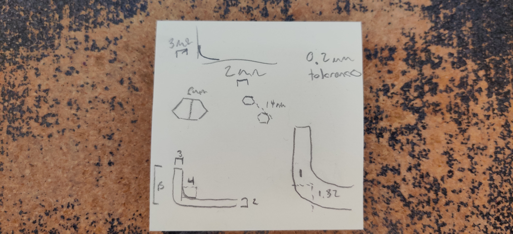
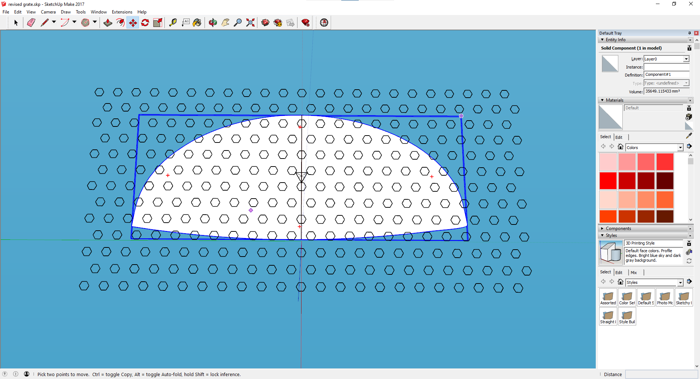
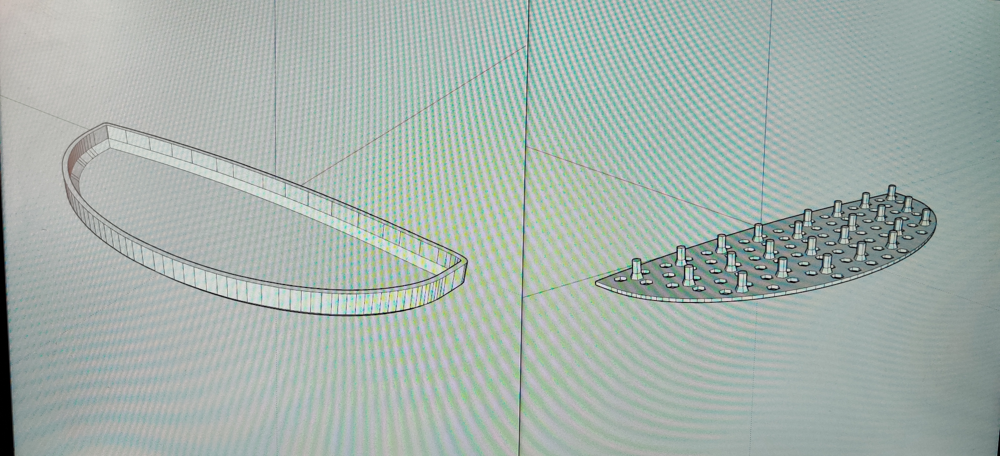
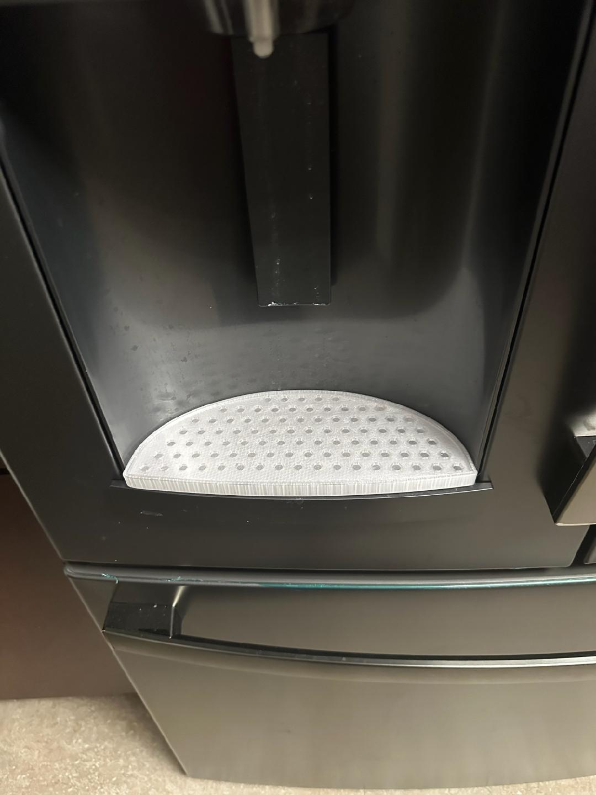

## Introduction

At some point in the past, I found a model of [a drip tray](https://www.thingiverse.com/thing:4694992) on Thingiverse for the refrigerator my mom owned and printed a copy for her as a gift.  More recently, she had the refrigerator replaced, but the new model still lacked any sort of built-in drip tray for the water dispenser, so it'd leak all over the place with any sort of regular use.

She reached out to me to see if I could 3D print her a new tray for the new refrigerator, so I started looking into it.  Unfortunately, I wasn't lucky enough for the same type of tray to exist.  The original was a two-part tray, with a separate grate that sat in the tray to give containers clearance from the excess water.

However, I was able to find [a different model](https://www.printables.com/model/114840-water-tray-for-ge-refrigerator) that gave me the contours of the new refrigerator, and decided to fuse the old and the new into a custom model for my mom to use.

## Taking Measurements

My overall goal was to modify the original tray design to use the contours of the new tray, so it'd fit in the new refrigerator.  With that in mind, I began by taking notes on the dimensions of the original tray, that I'd use when designing the new one.  Below are those original notes (there's not too much detail, just enough to help me get a sense of dimensions involved in the new tray):

    LG tray base details
        side thickness: 3
        base thickness 2
        inner chamfer: 4
        outer chamfer: 1 horizontal, 2 vertical
        overall height: 15

    LG tray insert details
    note: 6 rows of hexes, with alternating pegs between each pair of rows
        thickness: 2
        tolerance: 0.2
        hex details
            side-to-side: 6
            point-to-point: 14
        peg details
            note: centered between every other trio of hexes
            base side-to-side: 6
            narrowing point elevation: 3
            height: 11.6
            top side-to-side: 4

(Note: all measurements were in millimeters.)

## Making the Model

Once I had the measurements I thought I'd need, I started working on the model in SketchUp.

I started by flattening the model of the newer tray to a single, 2D plane.  This gave me a working base for both the tray, and in turn, the grate.  From there, I created a new tray model, with the only real difference being that I had trouble recreating the fillets and opted for simpler chamfers instead.

The tray took a little more work, as I wanted to to be as close to the previous design as possible.  I started with a concentrically offset outline of the tray, and overlaid that with an array of the hex pegs from the previous design.  It took a bit of fiddling around with the pegs to get an appropriate spread of them that would be stable and sturdy.

## Printing

Once I was satisfied with the models, I fired off the print.  I did a fit test of the two parts and was lucky enough to have them fit correctly on the first try.  We were able to meet up for the holidays, so I handed the parts off to her and she took them home to try them out.

Overall, she was happy with the results, and I was glad to have a chance to dust off my modeling and printing skills again.
